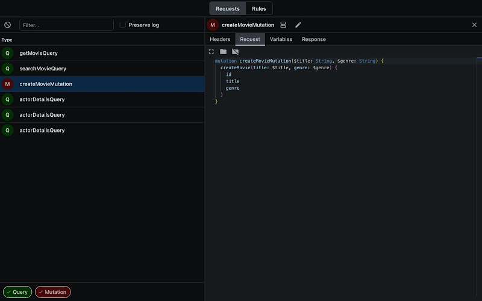

# GraphQL Network Tab

Simple extension specifically built for GraphQL that extends the default possibilities of developer tools.

Extension allows you to browse your GraphQL requests efficiently and to mock their responses so that you can test your application with ease.

The extension is powered by [monaco-editor](https://github.com/microsoft/monaco-editor) to provide excellent experience while examining responses and graphQL requests, as it has many popular features such as search, collapsible code blocks, you name it.

The extension also allows mocking requests to test your web application, the feature needs polishing though.

Inspired by [https://github.com/warrenday/graphql-network-inspector](https://github.com/warrenday/graphql-network-inspector).
